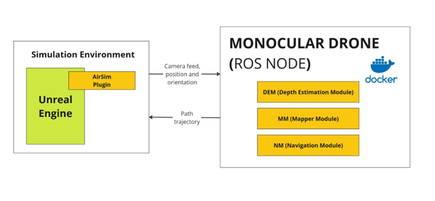
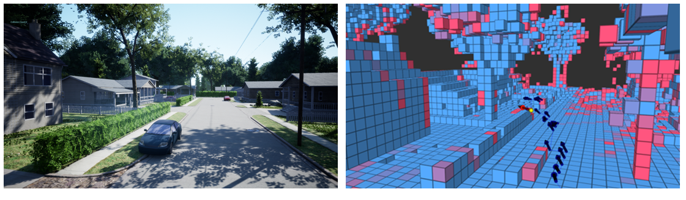

# A Framework for Autonomous UAV Navigation Based on Monocular Depth Estimation

|                                                                                  UAV                                                                                   |
| :--------------------------------------------------------------------------------------------------------------------------------------------------------------------: |
| [](https://www.youtube.com/watch?v=VIDEO-ID) |

## Citation

When using A Framework for Autonomous UAV Navigation Based on Monocular Depth Estimation, please cite the following journal paper ([pdf](...), [video](...))

```bibtex
@article{monocular-slam-drone,
  title={A Framework for Autonomous UAV Navigation Based on Monocular Depth Estimation},
  author={Gaigalas Jonas and Perkauskas Linas and Gricius Henrikas, Kanapickas Tomas and Kriščiūnas Andrius},
  journal={TODO},
  year={2024},
  publisher={TODO},
}
```

## About project

The solution utilizes a depth image estimation model to create an occupancy grid map of the surrounding area and uses an A\* path planning algorithm to find optimal paths to end goals while simultaneously navigating around the obstacles. The simulation is conducted using AirSim in Unreal Engine. With this work, an open-source framework was proposed and scenarios in three different open-source virtual environments, varying in complexity, to test and compare autonomous UAV navigation methods based on vision.

## Prerequisites

- Docker installed (with docker-compose support).
- NVIDIA GPU and drivers with CUDA support for GPU acceleration (optional).
- X11 server running for displaying graphical applications (e.g., `VcXsrv` for Windows). Material for setting up X11 server on Windows is also included below (optional).

## Project setup steps

Follow the steps below to set up the project on your local machine. The project is containerized using Docker, so you need to have Docker installed on your machine.

1. Clone repository with included git submodules by running the following command:

```bash
git clone --recurse-submodules https://github.com/jonasctrl/monocular-slam-drone.git
```

2. To build the project using docker compose, run the following command:

```bash
docker compose up --build
```

3. Create .env file in the root directory and update file with your system specific variables. Env will help with display forwarding from docker containers to your machine. If you need to setup X11 server for display forwarding please navigate to the end of document to the "Setting Up X11 Server for Display Forwarding" section. Currently, the following variables are used:

```bash
DISPLAY=192.168.0.120:0 # NOTE: .env.example contains general steps how to find your display for X11 forwarding
```

4. Select environment that we want to use and importing fine-tuned model for it. Fined-tuned models are located in google drive for each environment: [Model fine-tuned](https://drive.google.com/drive/folders/1gltcgQN3v4rantBJoUvqbjOjwxZHS9f1?usp=sharing)

Models are trained on the following dataset: [Model Datasets](https://ktuedu-my.sharepoint.com/:f:/g/personal/inglagz_ktu_lt/EtqAXut9CBtEgt6E24aQw7IBuQFxnNmzaBhxITkXozNysg?e=ahmvMk)

5. Start simulation environment in Unreal Engine. The simulation environment is set up using AirSim. The simulation environment can be downloaded from the following link: [AirSim Environments](https://github.com/microsoft/airsim/releases)

6. After starting the simulation environment AirSim will create configuration files in the following directory: `C:\Users\{username}\Documents\AirSim\`. Copy the configuration file `settings.json` from repository that is located in config folder to the AirSim config directory.

7. To start the project, run the following command inside the docker container. Following command will start the UAV system in the ROS environment:

```bash
python3 /catkin_ws/src/drone-node/src/mapper_nav_ros.py
```

The red grid shown in Rviz is the uncertain depth space and the blue one is the occupied-known space. RVIZ window GUI can be used to plan specified mission by using 2D planning tool.

## Architecture

The proposed architecture for an autonomous monocular drone navigation system is depicted in schema below. The system is divided into a simulation environment and a drone of navigation system called a "Monocular drone". For the simulation environment, `Airsim v1.8.1` was used. The navigation system runs in a containerized Docker environment running `Ubuntu 20.04` guest. The `ROS noetic v1.17.0` framework was used for communication between these two parts.



The navigation system was further divided into three modules:

- Depth estimation module (DEM) - This module is responsible for estimating depth images from the RGB camera feed provided by the simulation environment. For this task, the "Depth Anything V2" model was utilized.
- Mapper module (MM) - The purpose of MM is to build and iteratively update the oc-cupancy map-based 3D environment using depth images supplied by DEM and camera position and orientation retrieved from the simulation environment.
- Navigation module (NM) - This module finds viable path trajectories to specified points in an everchanging mapped 3D environment. Path-finding logic is based on the A\* algorithm. The output of this module is fed back to the simulation environ-ment.

## Depth Mapping in 3D Space

The following images show the depth estimation and mapping process. The first image shows real camera image. The second image shows the mapping process in 3D space. The red grid represents the uncertain depth space, and the blue grid represents the occupied-known space.



If there is suggestions or needed adjustments feel free to [create an issue](https://github.com/jonasctrl/monocular-slam-drone/issues) if you have any problems.

## Setting Up X11 Server for Display Forwarding

**WINDOWS**
If you're running this on Windows, you can set up an X11 server using `VcXsrv`. Download and install it from the following link:

- [VcXsrv SourceForge](https://sourceforge.net/projects/vcxsrv/)

Ensure that `DISPLAY` is correctly set in your Docker run command to match your X11 server configuration. It is also recommended to disable access control on the X11 server to avoid permission issues:

If using windows based app you just need to check the box "Disable access control" in the VcXsrv configuration.

**LINUX**
If using linux based environment, you can use the following commands to grant access to the X11 server:

```bash
export DISPLAY=host.docker.internal:0
xhost +
```

If you want to test the X11 setup, you can run the following command inside the container:

```bash
xclock
```

This should display a clock on your X11 server. If you see the clock, the X11 setup is working correctly. If not, check your X11 server configuration and Docker run command.
